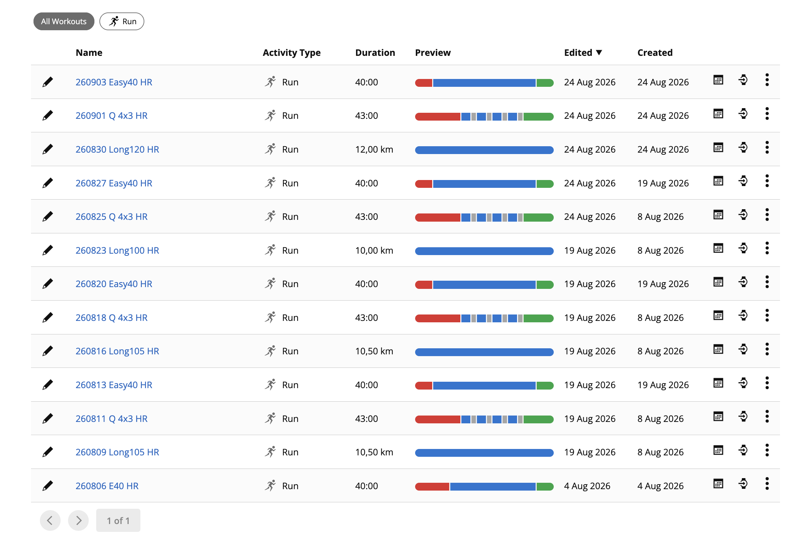
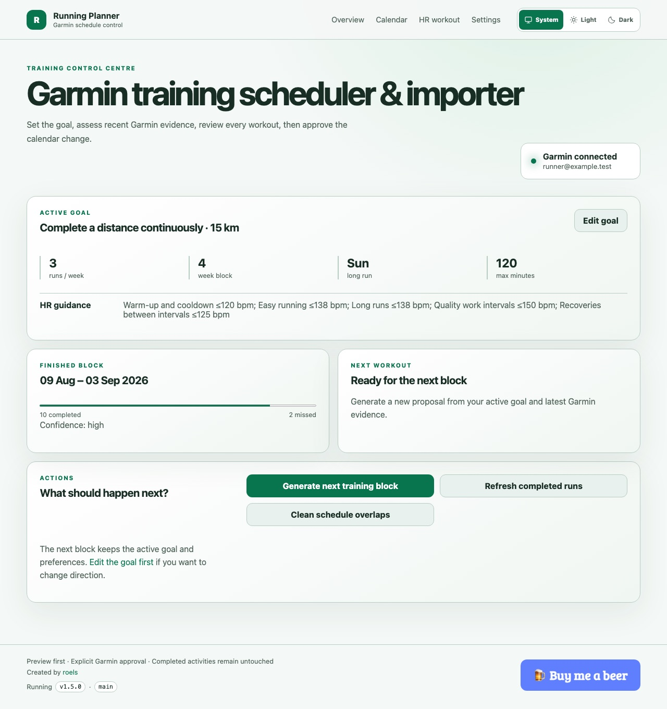
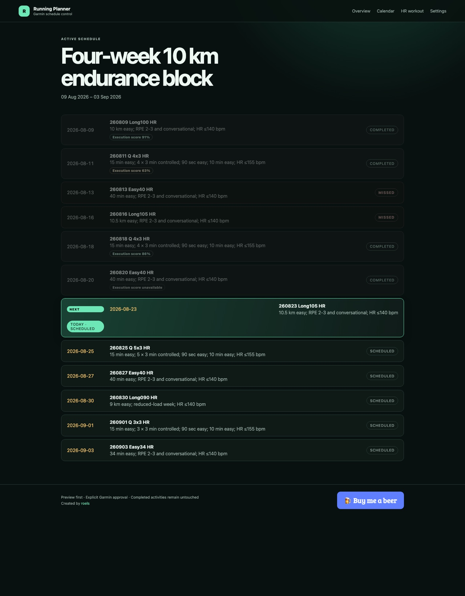
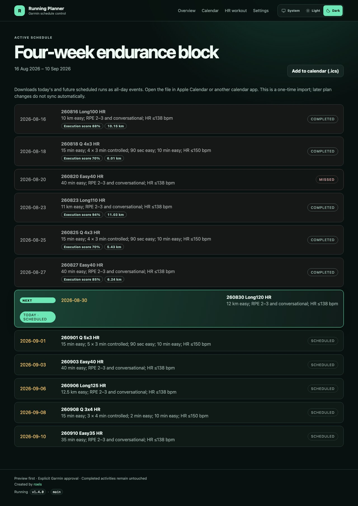
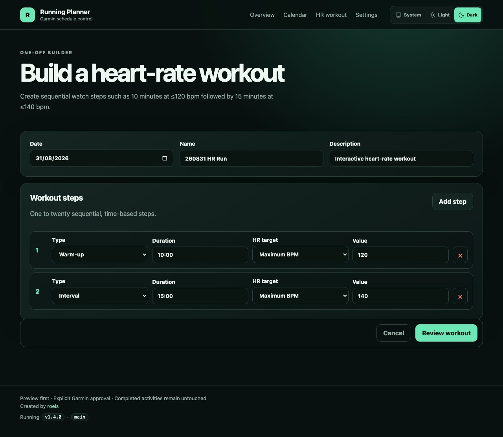

# Garmin Running Workouts Import

Create a running plan from your goals and recent activities, then **automatically upload the approved workouts to Garmin
Connect and schedule them on their planned dates**. Use the web interface or interactive CLI; YAML is available for
advanced use, not required for normal planning. This fork is intentionally running-only; use the upstream project for
other sports.

> Garmin does not publish the web endpoints used by this tool. Garmin may change them without notice, and authentication can occasionally require maintenance. This fork uses the actively maintained `garminconnect` client for the current authenticated API.

Current release: **1.5.0** · [Changelog](CHANGELOG.md) · [Release notes](docs/releases/v1.5.0.md)

## From training plan to Garmin Connect and your watch

1. **Plan and review:** define your goal and availability, assess recent running data, and review the proposed block.
2. **Approve and upload the block:** the tool creates or updates each structured workout in your Garmin Connect
   workout library and schedules it on the correct Garmin calendar date. Warm-ups, intervals, recoveries, cooldowns,
   and configured pace or heart-rate targets are included—no need to recreate each workout manually in Garmin Connect.
3. **Sync and run:** send/sync the scheduled workouts from Garmin Connect to a compatible watch, then select the day's
   workout from its training calendar. Watch transfer uses Garmin's normal device-sync process; the tool handles the
   Garmin Connect upload and scheduling. See Garmin's
   [training-calendar documentation](https://www8.garmin.com/manuals/webhelp/GUID-F41EAFB3-6CC9-42DE-9C6C-9E358DBB0671/EN-US/GUID-F5EB9C7C-A74E-4A26-BFB5-1E6DA4399067.html).

When you approve an adapted plan, the same workflow uploads the replacement and handles the agreed cleanup of obsolete
upcoming entries. Completed activities stay untouched. The optional `.ics` download is separate: it adds events to
Apple Calendar or another calendar app, not the structured workouts to Garmin.

## Screenshots

### Uploaded workouts in Garmin Connect



The uploaded result in Garmin Connect: easy runs, interval sessions, and long runs with their structured steps. This
maintainer-provided screenshot shows the **workout library**; the tool also schedules those workouts on the Garmin
calendar when you apply the plan. The dates and sessions shown are examples, not a suggested plan for every runner.

### Planner web interface

The web-interface examples below use a fully synthetic runner profile; they contain no real Garmin credentials or
activity data. The calendar deliberately includes completed runs with execution scores and actual distances, a missed
run, today's next workout, and future workouts. The top-right appearance control follows the system by default and also
offers persistent Light and Dark overrides.



| Light calendar | Dark calendar |
| --- | --- |
|  |  |



## Features

- Automated Garmin Connect workout upload **and dated calendar scheduling** for an approved training block, from either
  the web interface or CLI.
- Running workouts with warm-up, interval, recovery, rest, cooldown, and other step types.
- Time, distance, or lap-button step endings.
- Pace ranges written naturally as `6:00-6:10` or `["6:00", "6:10"]` per kilometre.
- Heart-rate caps, custom BPM ranges, and Garmin heart-rate zones.
- Explicit repeat groups.
- Dated multi-week plans in one YAML file.
- Preview-first plan application: uploading and scheduling require explicit approval (`--apply` for YAML plans).
- Create-or-update by workout name and duplicate-safe calendar scheduling.
- Preview-first retirement of old plans, including future-calendar cleanup and protected-plan handling.
- Validation for ISO dates and watch-visible name collisions in the first 15 characters.
- Chronological listing of completed Garmin activities with distance, duration, pace, and heart rate.
- Adaptive selection and automatic download of private original FIT assessment bundles.
- Local decoding of FIT files with Garmin's official FIT SDK.
- An interactive, goal-driven planner: no YAML editing is required for normal use.
- A dashboard with the active goal, completed/missed/remaining days, and the next workout.
- A date-aware calendar that subdues finished dates, identifies missed runs, shows actual completed distances, highlights today's workout, and keeps the next actionable run obvious.
- Garmin workout execution scores for completed planned runs, fetched once from original FIT data when necessary and cached locally.
- Supervised mid-block adaptation that replaces only future workouts after explicit approval.
- Garmin-side overlap detection with explicit consent to retire pre-existing schedules and obsolete templates.
- An on-demand cleanup action that protects the active local plan while removing older Garmin entries on the same dates.
- Interactive heart-rate caps, custom ranges, and Garmin zones by workout phase.
- A one-off HR workout builder for arbitrary sequential steps without YAML.
- A responsive, preview-first web dashboard backed by the same planner, state, Garmin client, and FIT evidence.
- System-aware light and dark web themes with a persistent top-right appearance override.
- A deterministic planning engine that works without an LLM, plus optional provider-neutral LLM explanations.
- Portable SQLite state and file-based session tokens; no macOS Keychain dependency.
- Versioned YAML/JSON artifacts suitable for future desktop and mobile clients.

## Installation

Python 3.12-3.14 and [uv](https://docs.astral.sh/uv/) are required.

```shell
git clone https://github.com/roelsroels/garmin-running-workouts-import.git
cd garmin-running-workouts-import
uv sync --dev
```

Use the repository launcher for every command. It runs the source directly and
does not depend on Python editable-install loaders:

```shell
./garmin-workouts --help
```

On systems without the POSIX launcher, use the equivalent Python entry point from the repository directory:

```shell
uv run --no-sync python -m garminworkouts --help
```

## Interactive planner (recommended)

Start the CLI without a command:

```shell
./garmin-workouts
```

On first use, the wizard asks only for the information needed to construct a plan:

1. Garmin Connect username. The password is requested with hidden input only when login is needed and is never saved by the application. If Garmin requires two-factor authentication, the CLI then requests the one-time code with another hidden prompt.
2. A measurable primary goal, start date, planning period (four weeks by default), available running days, long-run day, and current constraints.
3. Whether optional LLM explanations should be enabled. The planner itself does not require an LLM.
4. Whether to fetch recent Garmin history, generate a proposal, and review it before scheduling.

Later starts open a readable dashboard. From there, refresh completed runs and their available Garmin execution scores, view the full status-aware calendar, revise the goal, generate a new block, or assess completed FIT files and propose an adaptation to the remaining dates. When the applied block has no workouts remaining, **Generate next training block** replaces the adaptation action and starts a reviewable continuation from the active goal.

Nothing is changed in Garmin merely by opening the app or generating a proposal. Upload, scheduling, and replacement each require confirmation. When replacing a block, the tool uploads the approved replacement first, then unschedules future entries from the retired block and deletes only its obsolete workout templates. Completed Garmin activities and downloaded FIT files are never deleted.

Before uploading, the CLI also checks Garmin itself for already scheduled workouts on every proposed date. This catches schedules made by older YAML versions or other tools that are absent from the local planner database. It lists each conflict and asks whether to remove the old calendar entries. Template deletion is a separate confirmation. Declining removal requires a second explicit confirmation before duplicate calendar entries are allowed.

If duplicates already exist, choose **Review and clean Garmin schedule overlaps** from the main menu. The active local plan is treated as the version to keep. The tool previews older running workouts scheduled on those same dates, asks before unscheduling them, and separately asks whether their workout-library templates may also be deleted. A template can be reused on another calendar date, so retain it when unsure. This operation never deletes completed activities.

During goal setup, optional heart-rate guidance can be configured separately for warm-up/cooldown, easy running, long runs, quality work, and interval recovery. Choose upper BPM caps, BPM ranges, or Garmin zones. These are user-supplied watch alerts—not calculated or clinically validated zones. Garmin supports only one intensity target per step, so when quality work has both goal pace and HR guidance, the wizard asks which target should be primary.

The main menu also includes **Create a one-off heart-rate workout**. It builds sequential time-based steps interactively, enabling workouts such as 10 minutes at a 120 bpm maximum followed by 15 minutes at a 140 bpm maximum without editing YAML.

The architecture-independent local state defaults to `~/.garmin-running-workouts/` and contains:

- `state.sqlite3`: goals, plan history, workout status, cached execution scores, settings, and an audit trail;
- `tokens/`: reusable Garmin session tokens;
- `plans/`: generated, reviewable YAML plans;
- `activities/`: private FIT assessment bundles and decoded JSON evidence.

Directories are created with private permissions where the operating system supports them. Override the location with `GARMIN_WORKOUTS_HOME` or `--data-dir`. There is deliberately no Keychain integration. Garmin and LLM passwords/API keys are not stored in SQLite; use a session prompt or environment variable when automation needs them.

The same workflow is also available as explicit commands:

```shell
./garmin-workouts setup
./garmin-workouts status
./garmin-workouts refresh
./garmin-workouts generate
./garmin-workouts adapt
```

YAML commands remain available as an advanced/manual interface and as a transparent interchange format for coaches and future apps.

### CLI and web feature coverage

The web interface does not shell out to an interactive terminal process. It calls the same Python domain classes used by the CLI: `Goal`, `DeterministicPlanner`, `AppState`, `PlanApplier`, `ScheduledConflictCleanup`, `PlanRetirement`, the FIT analyzer, and the rate-limited Garmin client. This keeps validation and Garmin behavior consistent while allowing web requests to remain non-interactive.

The existing CLI commands and parameters remain available. The YAML, activity, export, list, get, schedule, delete, setup, status, refresh, generate, and adapt commands are unchanged. Run `./garmin-workouts COMMAND --help` for their parameters. Not every answer in the terminal wizard has a separate command-line flag: goal fields, phase-specific HR targets, deletion consent, and arbitrary one-off workout steps are interactive terminal inputs or web form inputs. Their generated plans remain YAML/JSON artifacts, so unattended automation can continue to use `plan`, `plan-retire`, and the activity commands.

The `web` command adds `--host`, `--port`, `--web-debug`, and the local-development-only `--insecure-cookie` option. Global `--data-dir`, `--username`, `--token-store`, and `--debug` options still go before the command and are honored by the web launcher. A command-line `--password` is intentionally not carried into the long-running web process; connect through the HTTPS settings form or provide reusable tokens instead.

## Web planner

The web dashboard provides:

- system-aware light and dark themes, with a persistent appearance switch at the top-right;
- goal, availability, distance/time/pace, planning-period, and constraint forms;
- independent maximum-BPM, BPM-range, or Garmin-zone targets for every workout phase;
- current block progress, next workout, and a status-aware calendar with completed, missed, today, and future states;
- a finished-block state with a clear **Generate next training block** action that refreshes Garmin progress and FIT
  evidence, starts after the previous block, and still requires review and explicit approval before scheduling;
- an iCalendar (.ics) download of upcoming scheduled runs for Apple Calendar and other calendar apps;
- cached actual distances and Garmin execution scores for completed planned workouts;
- preview-only plan generation and FIT-driven adaptation;
- approved upload of structured workouts to Garmin Connect and scheduling of the full block on its planned dates;
- two-stage Garmin login when an account requires an authenticator, email, or SMS verification code;
- an explicit Garmin conflict inspection and removal decision before application;
- protected cleanup of duplicates already present in Garmin;
- a dynamic one-off heart-rate workout builder;
- Garmin reconnection without storing the password; and
- optional Claude (Anthropic) and OpenAI-compatible LLM settings, with masked, temporary API-key entry.

### Appearance

The top-right **System / Light / Dark** switch appears on every page. **System** is the default and follows your
operating system or browser appearance, including changes while the page is open. Choose **Light** or **Dark** to
override it; the choice is remembered in this browser across visits. Select **System** again to clear the override.
This preference is local to the browser, not your Garmin account, and does not change the CLI. If browser storage
is blocked, switching still works for the current page. Without JavaScript, the colours follow the system setting.

### Calendar status and execution scores

The CLI and web calendar use the same local progress state:

- **Completed** means a running activity was matched to that planned date. The row is subdued because no action remains.
- **Missed** means the planned date has passed without a matched run after a progress refresh. If the date has elapsed but Garmin has not yet been refreshed, the web calendar shows **Missed · needs refresh** so provisional state is not mistaken for confirmed history.
- **Today · scheduled** marks a planned run on the current date. The first scheduled workout on today or a future date also receives the prominent **Next** treatment.
- **Scheduled** identifies later workouts that remain in the active block.

For a completed planned run, the tool displays Garmin's workout execution score when Garmin recorded one. If the normal activity summary does not include it, the refresh workflow downloads that activity's original FIT file once, reads the score, and caches both the value and the checked state in SQLite. Later page loads do not download the activity again.

The actual recorded distance is stored from the matched Garmin activity and shown in kilometres beside the execution
score. After upgrading an existing installation, run **Refresh completed activities** once to populate distances for
completed workouts that were already in the local calendar history.

Garmin describes this score as adherence to the targets of a structured workout, not as a general fitness, effort, recovery, or health score. Garmin only calculates it for workouts with heart-rate, speed, pace, or power targets. The interface uses Garmin's documented bands: **good** 67–100%, **average** 34–66%, and **low** 0–33%. A completed run can legitimately show **Execution score unavailable** when no supported target or score was recorded. See Garmin's [workout execution score documentation](https://www8.garmin.com/manuals/webhelp/GUID-69467D38-DE67-4A49-A78A-F7C809EFF8B5/EN-US/MARQ_Athlete_%28Gen_2%29_OM_EN-US.pdf).

### Add planned runs to Apple Calendar

Open **Calendar** in the web interface and click **Add to calendar (.ics)**. Open the downloaded file on your Mac and
choose a destination calendar. Alternatively, use **File → Import** in Apple Calendar and select the file.
See Apple's [calendar import instructions](https://support.apple.com/guide/calendar/import-or-export-calendars-icl1023/mac).

The export includes today's and future **scheduled** runs from the active plan, with workout names and instructions.
Completed, missed, skipped, retired, and past entries are not exported. Because the planner stores dates rather than
start times, each run is an all-day event, marked as not busy. The link is hidden when no upcoming runs remain.

This is a one-time snapshot, not a subscription or two-way sync. Replanning in Garmin will not update or remove
previously imported events. Event IDs remain stable for repeated downloads of the same plan, but calendar apps handle
re-imports differently. Use a separate calendar for these runs and remove superseded future events before importing a
replacement block. Downloading does not contact Garmin, change your plan, or add events without your approval in the
calendar app. The file contains workout information, so keep it private if you do not intend to share it.

### Run the web planner locally

For local development only:

```shell
GARMIN_WEB_SECRET_KEY="$(openssl rand -hex 32)" \
./garmin-workouts web --insecure-cookie
```

Open `http://127.0.0.1:8765`. The built-in server is deliberately single-threaded to avoid concurrent Garmin requests. Production should use the supplied single-worker Gunicorn service behind nginx.

### Production deployment example

The supplied systemd and nginx files are intentionally generic examples for an advanced administrator. Their defaults use:

- service account: `garmin-workouts`;
- application checkout: `/opt/garmin-running-workouts-import`;
- private mutable state: `/var/lib/garmin-running-workouts`;
- environment file: `/etc/garmin-running-workouts/web.env`; and
- example hostname: `planner.example.com`.

Adapt the account, paths, timezone, hostname, and certificate locations to the target system before installing the files. Keep `GARMIN_WORKOUTS_HOME` and systemd's `ReadWritePaths` synchronized.

One possible Debian/Ubuntu setup is:

```shell
sudo useradd --system --user-group \
  --home-dir /var/lib/garmin-running-workouts \
  --create-home --shell /usr/sbin/nologin garmin-workouts
sudo install -d -o garmin-workouts -g garmin-workouts -m 0700 \
  /var/lib/garmin-running-workouts
sudo install -d -o root -g garmin-workouts -m 0750 \
  /etc/garmin-running-workouts

cd /opt/garmin-running-workouts-import
uv sync --no-dev --locked

sudo install -o root -g garmin-workouts -m 0640 \
  .env.web.example /etc/garmin-running-workouts/web.env
sudo editor /etc/garmin-running-workouts/web.env
sudo install -o root -g root -m 0644 \
  deploy/systemd/garmin-running-workouts-web.service \
  /etc/systemd/system/garmin-running-workouts-web.service
sudo systemctl daemon-reload
sudo systemctl enable --now garmin-running-workouts-web
```

Set `GARMIN_WEB_SECRET_KEY` in `web.env` to a long value generated by a cryptographically secure tool such as `openssl rand -hex 32`. Do not commit the resulting environment file.

Create HTTP Basic Authentication credentials for the website. These are separate from the Garmin account credentials:

```shell
sudo apt-get install apache2-utils
sudo htpasswd -c /etc/nginx/.htpasswd-garmin-workouts web-user
sudo chown root:www-data /etc/nginx/.htpasswd-garmin-workouts
sudo chmod 640 /etc/nginx/.htpasswd-garmin-workouts
```

Copy and edit the nginx example, replacing the hostname and certificate paths, then validate it before reloading nginx:

```shell
sudo cp deploy/nginx/garmin-running-workouts.conf.example \
  /etc/nginx/sites-available/garmin-running-workouts.conf
sudo editor /etc/nginx/sites-available/garmin-running-workouts.conf
sudo ln -s /etc/nginx/sites-available/garmin-running-workouts.conf \
  /etc/nginx/sites-enabled/garmin-running-workouts.conf
sudo nginx -t
sudo systemctl reload nginx
```

The app binds only to `127.0.0.1:8765`; nginx provides HTTPS and Basic Authentication. The web service uses one worker intentionally so the persistent Garmin pacing state cannot be bypassed by simultaneous requests. The deployment is a single-user instance: everyone admitted by the nginx password sees the same runner profile, Garmin tokens, and training state.

#### Publishing changes made on the server

Prefer developing in a separate clone and deploying reviewed commits. For an intentional small edit made directly in a deployment checkout, the guarded publishing helper provides a repeatable path:

```shell
scripts/publish-server-change "Adjust dashboard copy"
```

It fetches the configured remote, refuses to continue when the remote branch is ahead or divergent, runs the complete checks, and stages tracked modifications and deletions only. It then displays the staged diff and asks before committing, pushing without force, syncing locked production dependencies, and restarting systemd. Untracked files must be named explicitly:

```shell
scripts/publish-server-change "Add a new web asset" garminworkouts/static/new-asset.svg
```

Use `--no-restart` for documentation-only changes and `--yes` only in an already controlled non-interactive workflow. Defaults can be changed without editing the script:

```shell
PUBLISH_REMOTE=origin \
PUBLISH_BRANCH=main \
GARMIN_WEB_SERVICE=garmin-running-workouts-web \
scripts/publish-server-change "Update the planner interface"
```

The helper refuses known credential, database, token, FIT, archive, and personal-plan paths. It cannot recognize every possible secret, so the displayed staged diff remains the final safety check.

### Garmin two-factor authentication

Normal password and reusable-token logins behave as before. When Garmin explicitly requests an additional verification code:

- the interactive CLI pauses and requests the one-time code using hidden terminal input;
- the web interface redirects to a dedicated verification page after the password step;
- the pending web login is scoped to that browser, kept only in server memory, expires after five minutes, and allows at most three code attempts;
- the password is discarded from the pending client as soon as Garmin issues the challenge;
- neither the password nor verification code is written to SQLite, the token directory, logs, or the browser cookie;
- after successful verification, reusable Garmin session tokens are saved normally so later runs do not repeatedly request MFA.

The web MFA exchange needs the same in-memory Garmin client for both requests. Keep the documented single Gunicorn worker. A service restart, another worker, expiration, cancellation, or three rejected codes ends the pending login; enter the password again to start a fresh one.

Unattended commands cannot safely answer an unexpected MFA prompt. Establish reusable tokens first through `./garmin-workouts` or the protected web settings page. Garmin authentication mechanisms are private and can change without notice.

### Garmin rate limiting

Garmin Connect uses private, unpublished endpoints and may return HTTP 429 when an account or IP address sends too many requests. The client handles this conservatively:

- wrapper-level Garmin calls are spaced by at least one second;
- password login uses one selected strategy instead of the dependency's cascading strategy chain, preventing one action from generating several alternative login attempts;
- reusable session tokens are preferred, avoiding password login on normal later runs;
- the adaptation workflow reuses one authenticated connection for progress refresh, history retrieval, and FIT download;
- a 429 is never automatically retried;
- the first 429 creates a persistent 15-minute cooldown, with consecutive failures increasing it to 30 and then 60 minutes;
- a longer Garmin `Retry-After` response takes precedence;
- attempts during the cooldown fail immediately and show the local time after which another attempt is allowed.

Cooldown state is stored as `.garmin-request-limits.json` inside the private token directory and is shared by later CLI processes. It contains timestamps only, not credentials. Do not delete it merely to bypass the wait: that cannot remove Garmin's server-side IP limit and may extend the block.

The defaults can be adjusted for controlled deployments:

```shell
GARMIN_REQUEST_INTERVAL_SECONDS=1
GARMIN_RATE_LIMIT_COOLDOWN_SECONDS=900
GARMIN_RATE_LIMIT_MAX_COOLDOWN_SECONDS=3600
GARMIN_LOGIN_STRATEGY=mobile+requests
```

Supported single login strategies are `mobile+requests`, `mobile+cffi`, `widget+cffi`, `portal+cffi`, and `portal+requests`. Keep the default unless it cannot authenticate in your environment.

MFA and rate limiting are separate outcomes. An MFA verification request displays the code form; HTTP 429 activates the cooldown and is not treated as a code request. If Garmin rate-limits the verification itself, the pending login is discarded and the same cooldown rules apply.

## Preview a four-week plan

Previewing is offline and does not require Garmin credentials:

```shell
./garmin-workouts plan sample_plans/running-4-week-example.yaml
```

The command prints the exact Garmin payloads and makes no remote changes.

### Keep personalized plans local

The `personal_plans/` directory is ignored by Git so dated schedules, health-related
instructions, and training details are not published with the repository. Create or
place a plan there, then use the same preview-first workflow:

```shell
./garmin-workouts plan personal_plans/my-four-week-plan.yaml
./garmin-workouts plan personal_plans/my-four-week-plan.yaml --apply
```

## Apply and schedule a plan

The interactive planner uses hidden password input and saves reusable session tokens instead of the password. For legacy or unattended YAML commands, environment variables remain available. A `.env` file is an opt-in convenience and stores the password as plain text, so prefer the interactive login where possible and never commit or share the file.

```shell
cp .env.example .env
chmod 600 .env
```

Fill in `GARMIN_USERNAME` and `GARMIN_PASSWORD` in `.env`, then run. The CLI loads this local file automatically:

```shell
./garmin-workouts plan sample_plans/running-4-week-example.yaml --apply
```

Applying a plan:

1. Finds existing Garmin workouts by their full name.
2. Updates an existing definition or creates it and captures its Garmin ID.
3. Checks the Garmin calendar month by month.
4. Schedules only workout/date combinations that are not already present.

Use `--upload-only` with `--apply` to create the workout library entries without scheduling them.

After applying, sync Garmin Connect with the watch. A scheduled workout should appear for its calendar day under the watch's running workouts/calendar flow.

## Running workout YAML

```yaml
sport: running
name: "4x3 @ 6:00"
description: "Controlled three-minute repetitions"

steps:
  - { type: warmup, duration: "15:00" }
  - repeat: 4
    steps:
      - { type: interval, duration: "3:00", pace: ["6:00", "6:10"] }
      - { type: recovery, duration: "1:30" }
  - { type: cooldown, duration: "10:00" }
```

Supported running fields:

| Field | Examples | Meaning |
|---|---|---|
| `type` | `warmup`, `interval`, `recovery`, `rest`, `cooldown`, `other` | Garmin step type; defaults to `interval` |
| `duration` | `"2:00"`, `"1:05:00"` | End after time |
| `distance` | `400`, `"400m"`, `"10km"` | End after distance |
| `lap_button` | `true` | End when the lap button is pressed |
| `pace` | `"6:00-6:10"` | Pace alert range in min/km |
| `heart_rate_max` | `150` | User-defined upper cap, represented as Garmin's `35-150 bpm` target range |
| `heart_rate` | `[110, 130]` | Custom lower/upper BPM target range |
| `heart_rate_zone` | `2` | Garmin running heart-rate zone 1-5 |
| `description` | free text | Optional step instruction |

Use only one ending condition and one intensity target per step. Omitting all three ending fields means lap-button press. Pace targets are converted to Garmin's metres-per-second bounds with the faster limit first.

### Heart-rate cap example

Garmin workout intensity targets are ranges rather than one-sided limits. `heart_rate_max` uses Garmin's 35 bpm custom-workout floor as the lower boundary, making it an effective upper-cap alert. The values below are syntax examples, not recommended zones:

```yaml
sport: running
name: "HR cap progression"
steps:
  - { type: warmup, duration: "10:00", heart_rate_max: 135 }
  - { type: interval, duration: "15:00", heart_rate_max: 155 }
  - { type: cooldown, duration: "10:00", heart_rate_max: 135 }
```

Use `heart_rate: [135, 155]` when the watch should alert at both the lower and upper boundary. Use `heart_rate_zone: 2` when the workout should follow the running HR zones currently configured in Garmin. The tool does not calculate or medically validate those zones.

## Dated plan YAML

```yaml
name: "Four-week block"
workouts:
  - date: 2030-01-08
    sport: running
    name: "300108 Q 4x3"
    description: "Quality session"
    steps:
      - { type: warmup, duration: "15:00" }
      - repeat: 4
        steps:
          - { type: interval, duration: "3:00", pace: "6:00-6:10" }
          - { type: recovery, duration: "1:30" }
      - { type: cooldown, duration: "10:00" }
```

Putting `YYMMDD` at the beginning of each name makes a workout easy to identify on the watch. The tool rejects different names that would look identical when only their first 15 characters are visible.

## Import a single workout

```shell
./garmin-workouts import sample_workouts/running-6x2.yaml
```

Other upstream commands remain available:

```shell
./garmin-workouts list
./garmin-workouts get --id WORKOUT_ID
./garmin-workouts schedule --date 2030-01-08 --workout_id WORKOUT_ID
./garmin-workouts export ./exported-workouts
```

## Download completed running activities

The older `export` command above exports saved workout definitions. Completed activities recorded by the watch use the separate `activities` commands.

List the latest completed runs, newest first:

```shell
./garmin-workouts activities list --last 20
```

Or list a date range:

```shell
./garmin-workouts activities list --from 2029-11-01 --to 2029-12-31
```

Ask the selector how many recent FIT activities are useful for the next assessment without downloading anything:

```shell
./garmin-workouts activities recommend
```

Automatic selection queries 42 days of running history and normally selects all runs in the latest 28-day window. It backfills older runs until at least six are available and caps unusually dense samples at 16. The JSON response explains the choice and prints the exact suggested download command.

Prepare the recommended assessment bundle:

```shell
./garmin-workouts activities prepare
```

To request an exact number instead:

```shell
./garmin-workouts activities prepare --last 12
```

Garmin's original activity download is normally a ZIP. The tool safely extracts FIT payloads, validates their headers, names them by date and immutable Garmin activity ID, calculates SHA-256 checksums, and writes `manifest.json`. Repeating the command reuses identical files rather than creating duplicates.

The default output is `personal_activities/assessment-DATE/`. This directory is ignored by Git, and the directory, FIT files, and manifest are created with private local permissions. Use `--output` to choose a different private location.

Decode a prepared bundle manually with Garmin's official FIT SDK:

```shell
./garmin-workouts activities analyze personal_activities/assessment-DATE/manifest.json
```

This writes `analysis.json` beside the manifest. The interactive `adapt` workflow performs preparation and decoding automatically.

Example chat-assisted workflow after a training block:

```text
Fetch the recommended recent Garmin FIT assessment set, assess my progress,
and prepare the next four-week running plan for review.
```

The manifest is the stable handoff between Garmin acquisition, FIT analysis, plan generation, and delivery. That separation allows the same code to support this CLI now and a macOS/iOS interface later.

## Four-week FIT-driven workflow

The importer deliberately separates evidence, training decisions, and delivery:

1. Run `activities recommend` or let the assessment workflow choose the recent sample.
2. Run `activities prepare` to download the selected original FIT files and manifest.
3. Combine FIT evidence with a defined goal, training availability, RPE, recovery, and relevant context that the files cannot contain.
4. Generate a dated four-week YAML proposal with a rationale and confidence level.
5. Preview and validate the block locally.
6. Explicitly apply it to Garmin Connect.
7. Reassess before the next block rather than automatically progressing from one activity.

The project is generic: it does not contain a personal medical profile and does not infer health status from Garmin data. Optional injury, health-professional, or other constraints are accepted only when the runner supplies them explicitly.

## How a four-week schedule is designed

### What is automated today

The software automates Garmin access, recent-activity selection, original FIT download and decoding, goal-driven plan generation, YAML validation, workout upload, calendar scheduling, progress tracking, supervised adaptation, and old-plan retirement. The built-in planning engine is deterministic and locally auditable; it is **not** a clinically validated exercise-prescription algorithm.

Training decisions use the declared goal, demonstrated recent frequency, duration and long-run exposure, and available days. Free-text constraints are retained and displayed for human review; the planner does not attempt to interpret arbitrary medical, injury, or coaching instructions. With insufficient history, the engine lowers its confidence, caps initial frequency, and substitutes familiar easy running for narrow quality targets. The result is always shown as a reviewable proposal. Garmin receives that fixed proposal only after confirmation; Garmin and the watch do not rewrite subsequent sessions themselves.

An optional Claude (Anthropic) or OpenAI-compatible LLM can explain an adaptation in plain language. It does not create
or silently alter workout definitions, and the normal planner works fully without it. Provider, model, and endpoint
settings are portable; API keys are supplied at runtime and never written to SQLite or application files.

#### Enable Claude explanations

1. In the web interface, open **Settings → Optional LLM explanation** and select **Claude (Anthropic)**.
2. Keep the default model (`claude-haiku-4-5-20251001`) or enter another Claude Messages API model ID available to your
   account. The native Claude endpoint is fixed to `https://api.anthropic.com/v1`.
3. Paste your Anthropic API key into the masked **API key** field and click **Save LLM settings**. Saving validates
   settings locally; it does not contact Anthropic or verify that the key has account access.
4. Open a plan proposal and click **Explain this proposal**. This is the step that sends the assessment to the provider
   and can incur API charges. Authentication, model-access, quota, and connection errors are shown without exposing
   the key or raw provider response. Failed requests are not automatically retried.

The entered web key is held only in server memory, scoped to that browser session and the saved LLM configuration.
It expires after one hour, is lost on a service restart, and is not placed in browser cookies or rendered back into
the page. Leave the field blank to retain an available key. Use **Forget this browser's temporary API key** to clear
it, or select **Disabled**. Switching provider or other connection settings requires a matching key again. The Settings
page uses a plain support link instead of loading the third-party footer widget on credential forms.

For a persistent setup, put `ANTHROPIC_API_KEY` in the protected environment file used by your web service and restart
the service. Keep **API-key environment variable** set to `ANTHROPIC_API_KEY`, and leave the key input blank. An entered
temporary key takes precedence over the environment. Forgetting a temporary key does not unset an environment key.
The in-memory option assumes the documented **single-worker** deployment; use an environment key for multiple workers.
The web app remains single-runner/shared-state software behind authentication, not a multi-user account service.

The interactive CLI offers the same choice under **Garmin connection and optional LLM settings → Configure optional
LLM**. It prompts for a hidden key if the configured environment variable is absent and keeps an entered key only until
the CLI exits. Existing OpenAI-compatible configurations remain supported, including local HTTP endpoints on loopback;
remote endpoints must use HTTPS.

Explanations send goal details (including free-text constraints), running summaries, rationale, and proposed calendar
changes to the selected provider—not Garmin credentials or original FIT files. The explanation is saved locally with
the plan. Only request it if you agree to share that assessment; normal planning and Garmin scheduling need no LLM key.
See Anthropic's [Messages API reference](https://platform.claude.com/docs/en/api/messages/create) and
[model documentation](https://platform.claude.com/docs/en/models/overview) for API access and model IDs.

### Scope and evidence boundary

Plans should be described as **evidence-informed running suggestions**, not diagnoses, medical clearance, or guaranteed injury prevention. General exercise-screening guidance can determine when a runner should seek qualified advice, but a generic FIT-driven tool cannot establish that a person is medically safe to train.

The planner should use this evidence hierarchy:

1. **Runner-specific measured evidence:** recent races or time trials, repeated comparable sessions, laboratory or field threshold results, and reliable FIT records.
2. **Runner-reported evidence:** RPE, recovery, pain or illness, training experience, adherence, and why a session changed.
3. **Running research and consensus:** intensity distribution, specificity, overload and recovery, monitoring methods, and resistance training.
4. **Coaching heuristics:** used only when stronger evidence is unavailable, labelled as such, and never presented as universal physiological rules.
5. **Garmin-derived estimates:** useful context and trends, but subordinate to raw observations and transparent rules because the algorithms are proprietary.

### Planning inputs

A useful plan combines five input groups:

1. **Goal and time horizon:** race distance and date, target time or pace, completion goal, consistency goal, or another measurable primary outcome.
2. **Training background:** running age, recent frequency and volume, current longest comfortable run, previous peak load, and recent interruptions.
3. **Constraints and preferences:** available days, long-run day, session-duration limits, terrain, equipment, injury status, and optional user-supplied health-professional limits.
4. **Objective running evidence:** duration, distance, moving versus elapsed time, pace, elevation, heart rate, laps, interval execution, recovery, cadence, and other FIT dynamics when recorded reliably.
5. **Context FIT cannot supply:** session RPE, sleep, weather, terrain detail, illness, pain, motivation, strength training, and why a workout was changed or stopped.

Running dynamics are supporting evidence, not automatic reasons to change a plan. A small cadence, ground-contact-time, or balance change can reflect pace, terrain, sensor quality, or fatigue rather than a problem.

### Data sufficiency and confidence

The current selector uses an operational minimum of six runs, looks back up to 42 days, and normally selects 6-16 activities. These are software confidence rules, not clinical or biological thresholds.

| Available history | Permitted inference |
|---|---|
| Fewer than 6 valid recent runs | Insufficient for individualized progression; create only a conservative familiarization proposal or request more history |
| At least 6 runs across roughly 4-6 weeks | Estimate recent frequency, volume, longest-run exposure, and broad easy-running response |
| 8-16 varied runs with comparable easy, long, and quality sessions | Compare execution, recovery, pace-to-HR relationships, and goal-specific tolerance with moderate confidence |
| Recent race, time trial, or repeated goal-specific work | Set performance targets with higher confidence, provided conditions and data quality are comparable |

Missing heart rate does not invalidate distance and pace analysis. Conversely, abundant heart-rate data cannot establish race fitness if there are no representative performance efforts. The system should lower confidence rather than invent thresholds. Where only summary history is available, it should avoid narrow pace or heart-rate prescriptions.

### Construction logic

Four weeks is used as a practical review block: long enough to repeat key sessions and observe direction, but short enough to avoid committing many weeks to an unsuitable progression. It is not a physiologically magic period.

The deterministic planner applies the following intentionally small and auditable rule set:

- Recent history covers up to 42 days. Fewer than six runs or fewer than 21 covered days is labelled `insufficient`; 6–11 runs or fewer than 35 days is `moderate`; broader history is `high` confidence. These labels describe data coverage, not health or readiness.
- Requested frequency is capped at no more than one run per week above the recently demonstrated frequency; with sparse history it is capped at three.
- Easy-run duration starts from the recent median session duration, bounded by 20–60 minutes and the runner's declared session limit. Easy intensity uses RPE 2–3 and the talk test, with no invented heart-rate zones.
- The long run starts from the recent longest run or the runner's supplied comfortable distance. For distance/endurance goals, only week three proposes a 5% increase (rounded to 0.5 km and capped by the distance goal); week four is reduced by 15%. This is a conservative software heuristic, not a universal law.
- Quality work is omitted when evidence is insufficient. Otherwise, time at a declared target pace is accumulated through controlled repetitions, capped at RPE 7. A sustain-pace goal also requires a requested duration so progression has a measurable endpoint.
- The engine changes the long-run dimension for distance/endurance goals and the quality-work dimension for pace/time/speed goals, avoiding simultaneous progression of both within this short block.
- FIT pace-to-heart-rate decoupling is calculated only when enough record-level samples exist. It is reported as descriptive context and is never a standalone progression rule.
- Heart-rate targets are generated only when a user or coach supplies them explicitly through YAML, the interactive CLI, or the web interface; the planner does not derive universal BPM zones.

These rules are deliberately conservative and limited. They make the current proposal reproducible and testable while leaving room for future, separately validated planning strategies.

A block is assembled from the runner's goal and demonstrated training frequency. For a runner already sustaining three runs per week, it might contain:

- one easy aerobic run, controlled primarily by RPE and the talk test;
- one longer easy run appropriate to the demonstrated long-run history;
- one controlled, goal-specific session;
- spacing consistent with the runner's recent tolerance;
- a consolidation or reduced-load week when the evidence supports it.

The plan normally keeps a clear majority of total running time at low intensity, but does not enforce a universal 80/20 split. Intensity distribution must be calculated consistently—preferably by time in a three-zone model—and adapted to training age, weekly volume, event demands, and response. Research supports both pyramidal and polarized distributions and does not establish one best distribution for every runner.

Progression is gated rather than automatic:

- preserve the runner's established frequency before adding another day;
- progress only after representative sessions are completed at the intended effort and recovery is acceptable;
- change one primary stressor at a time where practical: frequency, session duration, total volume, interval density, or intensity;
- avoid large single-session distance spikes relative to recent long-run exposure;
- use goal specificity gradually rather than making every session resemble the target event;
- prefer repeated evidence over one unusually strong or poor result;
- reduce or hold load when adherence, recovery, illness, pain, or data quality makes progression uncertain.

There is no universal “10% per week” law. Recent cohort evidence suggests that a single run much longer than the runner's recent longest run may matter, but this should be treated as a risk flag rather than a guarantee or universal cutoff. Exact progression increments, recovery spacing, and deload timing remain individualized decisions.

Intensity anchors should be chosen from the strongest available source: measured ventilatory/lactate thresholds; a recent race or valid field test; repeated comparable performance; or, when those are unavailable, RPE and the talk test supported by heart-rate trends. Age-predicted maximum heart rate and Garmin zones should not override better runner-specific evidence.

### How previous results change the next plan

Before a new block, `activities recommend` normally evaluates the latest 28 days and selects 6–16 recent runs from up to 42 days of history. `activities prepare` downloads the corresponding FIT files. The assessment then compares planned intent with actual execution:

- sessions completed, shortened, substituted, or skipped;
- weekly frequency, duration, distance, and long-run continuity;
- pace and heart rate for comparable easy running;
- pace stability and pace-to-heart-rate drift within longer steady runs;
- interval completion, rep-to-rep consistency, and recovery between efforts;
- stopped time and whether interruptions were training-related or environmental;
- RPE, sleep, heat, illness, injury, soreness, and recovery reported by the runner;
- data-quality limitations, such as missing chest-strap data or unreliable GPS.

Typical decisions are:

| Observed response | Likely next-block decision |
|---|---|
| Key sessions complete, even, controlled, and well recovered | Progress one dimension modestly |
| Goal pace achieved only in short reps | Accumulate more controlled time before making reps longer |
| Pace target met but RPE or recovery is excessive | Repeat or reduce; do not progress from pace alone |
| Long run is comfortable but quality is incomplete | Hold long-run distance and repeat quality work |
| Quality is controlled but long-run continuity is poor | Hold speed and address aerobic duration/continuity |
| Repeated fatigue, illness, pain, declining performance, or failed recovery | Reduce or pause load; seek qualified advice where appropriate |
| One exceptional or poor run without a repeated pattern | Treat as low-confidence evidence rather than immediately redesigning the block |

Within an active block, adaptation is **supervised and explicit**. The `adapt` workflow refreshes adherence, selects and downloads a recent 6–16-run FIT set, decodes original FIT records, rebuilds only dates that have not yet passed, and compares the result with the current schedule. If no workout definition changes, it recommends retaining the plan. If changes exist, it shows each changed date and asks for approval before touching Garmin. This keeps completed dates immutable and every calendar change reviewable.

Each future automated decision should expose the source data, the rule applied, the resulting change, and a confidence label. A plan should become more conservative when data is sparse, inconsistent, or unrepresentative.

### Garmin's role

Raw FIT observations are the primary Garmin input. Garmin VO2max, Training Effect, Training Load, Recovery Time, HRV Status, and Training Readiness may be retained as secondary context, but they should not be the sole reason to progress or cancel a workout. Their algorithms are proprietary, device-dependent estimates and cannot be fully audited by this project.

Garmin Daily Suggested Workouts use training load, load focus, VO2max, recovery, sleep, recent workouts, and—in some devices—detected lactate threshold. That is useful as a performance-oriented second opinion, but it does not modify an imported fixed plan. This project therefore performs its own transparent block reassessment rather than attempting to reproduce Garmin's black-box recommendation engine.

### Scientific status and limitations

The schedules are best described as **evidence-informed and individualized running suggestions, but not clinically validated prescriptions**.

The evidence-informed elements include goal specificity, a predominance of low-intensity running, bounded quality work, gradual overload, recovery, RPE/talk-test monitoring, resistance-training evidence, and periodic reassessment. Individualization comes from FIT history, training age, goal, adherence, reported effort, availability, preferences, and explicit user constraints.

Important limitations remain:

- Group-level research cannot predict an individual's response with certainty, and many running studies use small or trained samples.
- “80/20” depends on whether intensity is counted by sessions, time, pace, or heart-rate zones and should not be treated as a precise biological threshold.
- FIT heart rate, pace, and running dynamics describe exercise response but cannot diagnose health conditions or prove medical safety.
- Garmin VO2max and threshold estimates can be useful trends, but individual error can be meaningful and validation does not cover every population.
- Practical heart-rate caps in YAML are watch alerts, not automatically valid physiological zones.
- Data from different terrain, weather, sensor configurations, or training phases may not be directly comparable.
- A good recent trend reduces uncertainty but cannot guarantee that the next progression will be safe, injury-free, or effective.

The generic health boundary follows preparticipation-screening principles: a person with concerning symptoms, a known condition that affects exercise, or uncertainty about vigorous training should obtain appropriate professional guidance. The repository stores no diagnosis-specific policy by default.

### Main scientific references

- [ACSM exercise preparticipation screening guidance](https://www.exerciseismedicine.org/assets/page_documents/ACSM%20Preparticipation%20Screening%20Guidelines.pdf)
- [Systematic review of training-intensity distribution in middle- and long-distance runners](https://pubmed.ncbi.nlm.nih.gov/34749417/)
- [Systematic review and meta-analysis of polarized versus threshold training](https://pubmed.ncbi.nlm.nih.gov/29863593/)
- [Evidence for using the talk test to regulate running intensity](https://pubmed.ncbi.nlm.nih.gov/25536539/)
- [Session-RPE method for monitoring training load](https://pubmed.ncbi.nlm.nih.gov/11708692/)
- [Systematic review and meta-analysis of strength training and running economy](https://pubmed.ncbi.nlm.nih.gov/38165636/)
- [Prospective cohort study of single-session distance spikes and running-related injury](https://pubmed.ncbi.nlm.nih.gov/40623829/)
- [Garmin explanation of Daily Suggested Workouts](https://www.garmin.com/en-GB/garmin-technology/running-science/physiological-measurements/daily-suggested-workouts-feature/)
- [Independent systematic review of wearable VO2max estimates](https://pmc.ncbi.nlm.nih.gov/articles/PMC9213394/)

## Changing the training goal

The CLI does not silently infer or persist a training goal from Garmin data. A goal change is an explicit input to assessment and plan generation. This keeps a pace target, distance target, event date, or return-to-running objective from being changed merely because one activity was unusually good or bad.

For normal use, run `./garmin-workouts`, choose **Change the goal or availability**, complete the guided questions, and review the replacement proposal. The existing Garmin calendar remains unchanged unless you approve the replacement. The tool then schedules the new plan, retires only superseded future entries/templates, and leaves completed activities untouched. The manual YAML procedure below remains useful for coaches and advanced troubleshooting.

### 1. Describe the new goal precisely

Provide enough information to make success measurable:

```text
Current goal:
New primary goal:
Success measure:
Target date or time horizon:
Desired start date for the replacement plan:
Available running days:
Required long-run day:
Current longest comfortable run:
Recent quality session that was completed well:
Secondary goals:
Constraints and non-goals:
Recent RPE, recovery, illness, injury, or schedule context:
Optional health-professional or other user-defined limits:
```

Examples of measurable primary goals include running continuously for 10 km, completing 30 minutes at a defined target pace and effort, or preparing for a specific event. Choose one primary goal per block; other ambitions should be secondary constraints rather than competing progression targets.

### 2. Refresh the evidence

Ask for a recommendation and prepare the selected FIT set:

```shell
./garmin-workouts activities recommend
./garmin-workouts activities prepare
```

FIT files can show what happened, but not subjective RPE, sleep quality, unusual heat, illness, injury status, motivation, or the reason a session was shortened. Supply that context separately before generating the replacement plan.

### 3. Generate a replacement proposal

Use a request such as:

```text
Change my primary goal to [measurable goal] by [date]. Fetch or use the
recommended recent FIT assessment set, assess the gap to that goal, and create
a new four-week plan starting [date]. Preserve these constraints: [constraints].
Show the assessment and plan before making any Garmin changes.
```

For a small, compatible change, finishing the current block and applying the new goal to the next block is usually the simplest transition. For an incompatible or time-sensitive goal, create a replacement plan for the remaining future dates.

### 4. Review the plan offline

Save the proposal as a new dated file rather than overwriting the previous plan, then preview it:

```shell
./garmin-workouts plan personal_plans/NEW-DATED-PLAN.yaml
```

Check the start date, run days, long-run placement, recovery spacing, progression logic, intensity targets, and watch-visible names. A goal change does not silently remove user-defined constraints; update them explicitly when appropriate.

### 5. Replace future Garmin entries

Apply the reviewed replacement first:

```shell
./garmin-workouts plan personal_plans/NEW-DATED-PLAN.yaml --apply
```

Verify the new Garmin calendar before retiring the old plan. Leave completed activities untouched. Preview retirement while protecting any names or exact calendar entries reused by the new plan:

```shell
./garmin-workouts plan-retire personal_plans/OLD-DATED-PLAN.yaml \
  --protect-plan personal_plans/NEW-DATED-PLAN.yaml
```

The preview logs the exact future schedule IDs to unschedule, past calendar entries to retain, old workout definitions to delete, protected definitions to keep, and anything missing or unresolved. It makes no Garmin changes.

After reviewing the preview, retire the old plan explicitly:

```shell
./garmin-workouts plan-retire personal_plans/OLD-DATED-PLAN.yaml \
  --protect-plan personal_plans/NEW-DATED-PLAN.yaml \
  --apply
```

Retirement unschedules matching future calendar entries before deleting old workout templates. An unresolved future schedule ID blocks the operation. Recorded activities and downloaded FIT files are outside this workflow and are never deleted. `--protect-plan` is repeatable when multiple active plans must be retained.

For a mid-block replacement, apply and verify the new plan first, then retire the old plan using the commands above. Sync the watch again and verify the first scheduled workout and all weekend/weekday placement in Garmin Connect.

When a block has ended and no replacement reuses its workout names, omit `--protect-plan`:

```shell
./garmin-workouts plan-retire personal_plans/FINISHED-PLAN.yaml
./garmin-workouts plan-retire personal_plans/FINISHED-PLAN.yaml --apply
```

### 6. Reassess rather than automatically escalating

At the end of the block—or earlier if sessions are repeatedly incomplete, unexpectedly easy, or affected by recovery, illness, or injury—prepare a fresh FIT assessment bundle. Compare actual adherence and response with the new goal before progressing distance or speed again.

## Security and limitations

- `.env`, `.venv`, the Garmin token store, personal plans, and downloaded activity bundles are ignored by Git.
- The interactive workflow never persists Garmin or LLM passwords/API keys; protect the portable state directory because session tokens remain sensitive.
- If legacy automation uses `.env`, protect it with local file permissions and rotate any credential that may have been exposed.
- Do not run an unattended cloud job containing Garmin credentials.
- Authenticator, email, and SMS verification codes are supported, but Garmin's private endpoints, CAPTCHA, or future SSO/MFA changes can still break authentication.
- Applying and retiring plans are designed to be repeatable, but Garmin's private endpoint behavior can change; always review previews and verify the calendar after synchronization.

## Development

```shell
uv sync --dev
mise run check
```

This running-only fork is based on [mkuthan/garmin-workouts](https://github.com/mkuthan/garmin-workouts). This project remains available under the Apache-2.0 license.
